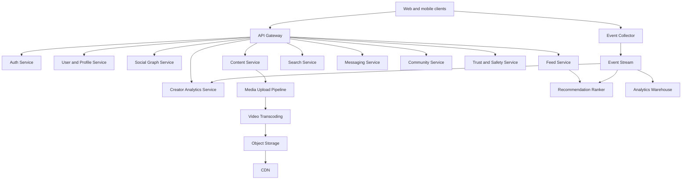

# Architecture

## Product Strategy

Build a community-first creator platform. The MVP should not try to clone every major social network. It should focus on a tight loop:

1. Users discover short-form content.
2. Users follow creators and join topic communities.
3. Creators publish consistently because the platform gives them feedback, analytics, and eventually revenue.
4. Communities create retention beyond the feed.

## Feature Sources

| Platform | Best idea | MVP adaptation |
| --- | --- | --- |
| TikTok | Interest-based discovery | Discover feed ranked by watch, skip, save, share, and follow signals |
| Instagram | Identity, profiles, stories, DMs | Creator profiles, private messages, and lightweight story-style community updates |
| YouTube | Channels, search, monetization | Creator studio, search, long-term analytics, subscriptions, and payouts later |

## Frontend

Start with a responsive web app:

- App shell navigation
- Feed
- Discover
- Create
- Communities
- Inbox
- Studio

Recommended future stack:

- Next.js or React for the web app
- React Native or native apps for mobile
- Shared design tokens
- Component library for navigation, posts, composer, cards, sheets, and modals

## Backend Services

## Data Stores

| Store | Use |
| --- | --- |
| PostgreSQL | Users, profiles, communities, follows, posts, comments, payments |
| Redis | Sessions, rate limits, feed cache, notification fanout cache |
| Object storage | Images, videos, thumbnails, attachments |
| CDN | Fast media delivery |
| OpenSearch | User, post, tag, community, and creator search |
| Event stream | Views, watch time, likes, saves, comments, shares, reports |
| Warehouse | Analytics, experiments, recommendation training, revenue reporting |

## Core Domain Models

- User
- Profile
- CreatorAccount
- Follow
- Community
- CommunityMembership
- Post
- MediaAsset
- Comment
- Reaction
- Save
- Share
- Conversation
- Message
- Report
- ModerationAction
- CreatorMetric
- PayoutAccount

## MVP API Surface

| Route | Method | Purpose |
| --- | --- | --- |
| `/auth/signup` | POST | Create account |
| `/auth/login` | POST | Create session |
| `/me` | GET | Current user |
| `/profiles/:handle` | GET | Public profile |
| `/posts` | POST | Create post |
| `/feed/home` | GET | Following plus recommended feed |
| `/feed/discover` | GET | Interest-based feed |
| `/communities` | GET | List communities |
| `/communities/:id/join` | POST | Join community |
| `/messages/conversations` | GET | List conversations |
| `/reports` | POST | Report content |
| `/studio/overview` | GET | Creator analytics |

## Recommendation MVP

Start simple and transparent:

- Positive signals: watch completion, likes, saves, comments, shares, follows
- Negative signals: quick skips, hides, reports, repeated uninterested behavior
- Context: community, creator, tag, format, freshness, language, location if allowed
- Guardrails: content quality, moderation status, diversity, new creator exploration

The first ranking formula can be rules-based. Move to ML after there is enough event volume.

## Trust And Safety

Required early:

- Report content
- Block and mute
- Keyword and URL abuse filters
- Rate limits
- Manual moderation queue
- Community owner tools
- Audit log for moderation actions

Add automated classifiers only after the workflow is clear.

## Build Roadmap

### Phase 1: Frontend MVP

- Static app shell
- Mock feed
- Mock communities
- Composer interaction
- Creator studio surface

### Phase 2: Real Data

- Auth
- Database schema
- API services
- Post creation
- Follow graph
- Community membership

### Phase 3: Media Platform

- Upload service
- Video transcoding
- Thumbnail generation
- CDN delivery
- Moderation queue

### Phase 4: Growth And Monetization

- Recommendations
- Notifications
- Creator analytics
- Subscriptions
- Tips
- Ads and brand safety tooling
